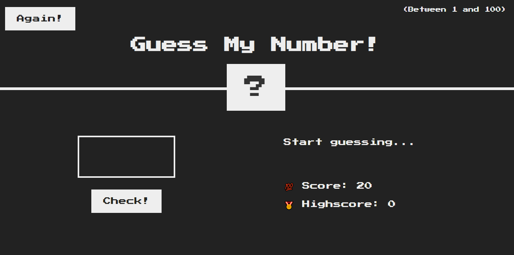

# Guess My Number

Jogo de adivinhação, onde você deve tentar adivinhar um número aeatório entre 1 e 100.

## Funcionalidades

- Interface interativa e amigável.
- Números aleatórios são escolhidas a cada rodada.
- Feedback visual do progresso do jogo.

## Screenshot



## Como Usar

1. Clone o repositório:

    ```bash
    git clone https://github.com/isabellatressino/guess-my-number.git
    ```
2. Abra o arquivo `index.html` no navegador de sua preferência.
3. Insira um número na caixa e aperte o botão `check` para testar um palpite.
4. Aperte o botão `again` para jogar novamente.

**OU**

Acesse o [Guess My Number Online]() para experimentar diretamente no seu navegador.

## Meu Aprendizado

Desenvolver este jogo foi uma oportunidade para aprimorar minhas habilidades em HTML, CSS e principalmente JavaScript, onde pude melhorar a estrutura do meu código, tornando-o mais limpo. 

## Notas:

Esse jogo foi uma proposta do curso [The Complete JavaScript Course 2024: From Zero to Expert!](https://www.udemy.com/course/the-complete-javascript-course/)

Divirta-se jogando!


